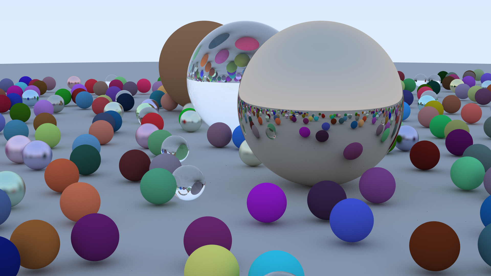

# toys

some toys.

- PixelGui: Providing `setPixel` function based on OpenGL.
- RayTracingInOneWeekend: Implement a simple ray tracer.
- rsa: A simple RSA implementation in Python.
- TruthTableGenerator: Generate truth table according to logic expressions.

## Pictures

### RayTracingInOneWeekend

